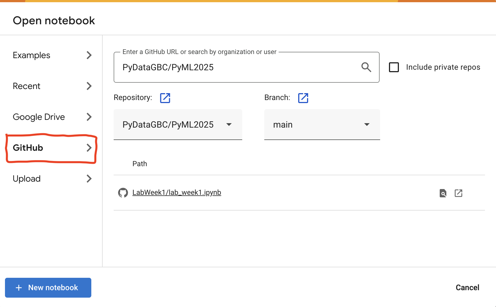

### Running the Notebook

To run the notebook:
1. [Google Colab](https://colab.research.google.com/) (Right-click and select "Open link in new tab").
2. Upload the notebook by following the steps illustrated in the image below.

 

### Saving and Downloading Your Notebook

After completing your work, save or download the notebook by clicking **File** menue in Google Colab.  

### Submitting Your Solution to D2L

Upload the `.ipynb` file as your solution.  
